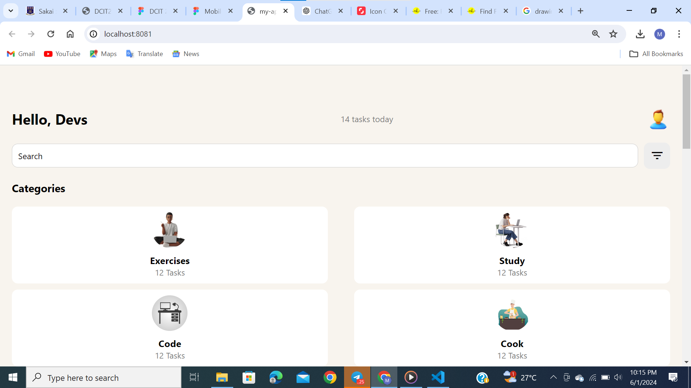

Brief discreption of the components:
The app is structured with a ScrollView to ensure the entire content is scrollable.
View components are used to group and layout different parts of the UI.
Text, TextInput, Image, and TouchableOpacity components are used for displaying text, input fields, images, and interactive elements respectively.
Icon libraries are used to provide visual icons for better UI.
Styling is managed through a StyleSheet to keep the layout organized and visually appealing.
